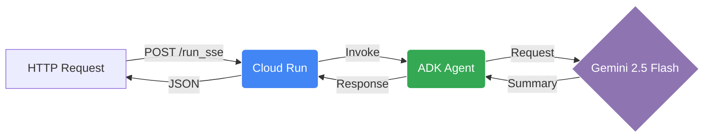

# 🤖 Gemini Summarization Agent

[](https://cloud.google.com/)
[](https://deepmind.google/technologies/gemini/)

A high-performance, serverless AI agent built using the **Google Agent Development Kit (ADK)**. This agent leverages **Gemini 2.5 Flash** via Vertex AI to provide intelligent, context-aware summarization for lengthy text inputs.

---

## 🏗️ System Architecture



## 🌟 Key Features

⚡ Gemini 2.5 Flash Powered: Optimized for speed and efficiency without sacrificing summary quality.

☁️ Cloud Native: Designed for native execution on Google Cloud Run.

🎯 Multi-Style Summarization: Supports three distinct output modes (Concise, Bullet Points, and ELI5).

🛠️ Modular Design: Built using the ADK to minimize boilerplate and maximize extensibility.

## 🎨 Summarization Styles

```bash
Concise: 2-3 professional sentences (Default) 
```

```bash
Bullet Points: A structured list of key findings and takeaways
```

```bash
ELI5: Explain Like I'm 5" using simple analogies
```

## 🚀 Usage Examples

### 1. Concise (Default)

#### Request: 
The Google Agent Development Kit (ADK) is an open-source framework designed to simplify the creation, deployment, and management of AI agents. Built with a focus on modularity and flexibility, the ADK abstracts away much of the boilerplate code typically required to integrate large language models (LLMs) into applications. It provides built-in support for various model providers, most notably the Google Gemini family, and offers seamless integration with Google Cloud services like Vertex AI and Cloud Run. By standardizing agent interfaces and deployment pipelines, the ADK enables developers to focus on defining their agents' core logic and instructions rather than wrestling with infrastructure.

#### Response: 
The Google Agent Development Kit (ADK) is an open-source framework that simplifies the creation, deployment, and management of AI agents. It reduces boilerplate code for integrating large language models (LLMs) and supports Google Gemini and Google Cloud services. The ADK streamlines development by standardizing agent interfaces, allowing developers to focus on core agent logic.

### 2. Bullet Points

#### Request: 
Summarize using bullet points 

The Google Agent Development Kit (ADK) is an open-source framework designed to simplify the creation, deployment, and management of AI agents. Built with a focus on modularity and flexibility, the ADK abstracts away much of the boilerplate code typically required to integrate large language models (LLMs) into applications. It provides built-in support for various model providers, most notably the Google Gemini family, and offers seamless integration with Google Cloud services like Vertex AI and Cloud Run. By standardizing agent interfaces and deployment pipelines, the ADK enables developers to focus on defining their agents' core logic and instructions rather than wrestling with infrastructure.

#### Response:
* The Google Agent Development Kit (ADK) is an open-source framework.
* It simplifies the creation, deployment, and management of AI agents.
* The ADK abstracts away boilerplate code for integrating Large Language Models (LLMs).
* It supports various model providers, including Google Gemini.
* It integrates seamlessly with Google Cloud services like Vertex AI and Cloud Run.
* The ADK standardizes agent interfaces and deployment pipelines.
* It allows developers to focus on an agent's core logic and instructions.

### 2. Eli5

#### Request: 
Summarize using eli5

The Google Agent Development Kit (ADK) is an open-source framework designed to simplify the creation, deployment, and management of AI agents. Built with a focus on modularity and flexibility, the ADK abstracts away much of the boilerplate code typically required to integrate large language models (LLMs) into applications. It provides built-in support for various model providers, most notably the Google Gemini family, and offers seamless integration with Google Cloud services like Vertex AI and Cloud Run. By standardizing agent interfaces and deployment pipelines, the ADK enables developers to focus on defining their agents' core logic and instructions rather than wrestling with infrastructure.

#### Response:
Imagine you want to build a super cool robot friend. The Google ADK is like a special box of LEGOs that makes it super easy to build your robot. It has all the pieces you need so you don't have to build them yourself, and it helps your robot brain (called an LLM, like Google Gemini) talk to other computer toys. This way, you can just focus on what awesome things your robot friend will do!

## Created by Shon Ferrao
